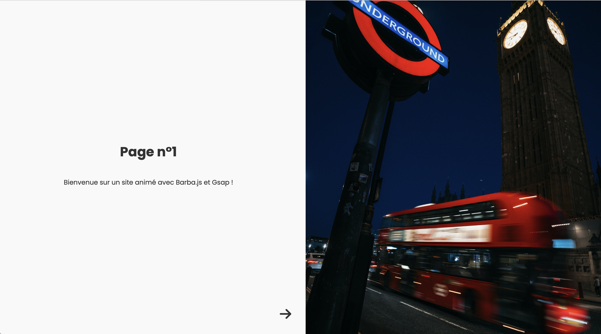

# Animated-Page

Animated-Page est une application web qui présente des transitions animées fluides entre ses pages. Grâce à l'utilisation de Barba.js et GSAP, chaque navigation devient une expérience immersive avec des animations soignées pour les images et le contenu textuel.

## Fonctionnalités

- **Transitions Animées** : Lors de la navigation entre les pages, les images se déplacent vers le haut tandis que le contenu textuel se déplace vers le bas, créant une transition en douceur.
- **Optimisé pour la Performance** : Utilisation de GSAP pour des animations hautement performantes.

## Comment l'utiliser ?

1. Cloner le repo.
2. Ouvrir le fichier `index.html` dans votre navigateur de choix.
3. Naviguer entre les pages pour observer les transitions en action !
   
## Personnalisation

1. Ouvrez le fichier JavaScript contenant les configurations Barba.js et GSAP.
2. Modifiez les paramètres des animations selon vos préférences (durée, éasing, délais, etc.).

## Contribution

Si vous avez des suggestions ou des améliorations, n'hésitez pas à ouvrir une issue ou à soumettre une pull request. Toutes les contributions sont les bienvenues!